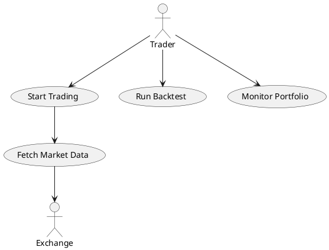

Below is a **more complete `specs.md` prompt** you can give to your **Cursor agent** so it generates a **full SRS (Software Requirements Specification) + UML documentation** for your **trading suite**.

This template instructs the agent to produce:

* System architecture diagrams
* Use case diagrams
* Interaction diagrams
* Sequence diagrams
* Class diagrams
* Activity diagrams
* State diagrams
* Data flow diagrams
* Component diagrams
* Deployment diagrams

It follows a structure close to **IEEE 830 / ISO SRS standards**.

---

# `specs.md` — Trading Suite SRS + UML Generation Prompt

````markdown
# Trading Suite – Software Requirements Specification (SRS)

## Objective

Analyze the repository and automatically generate a **complete Software Requirements Specification (SRS)** along with **UML diagrams** describing the system architecture, workflows, and module interactions.

This document should help developers understand how the trading suite works internally.

Follow IEEE-style SRS structure where possible.

---

# 1. System Overview

Describe the trading suite including:

- purpose of the system
- core capabilities
- architecture style
- major components

Example system responsibilities may include:

- market data ingestion
- indicator calculation
- trading strategy evaluation
- signal generation
- risk management
- order execution
- portfolio management
- performance analytics
- backtesting
- logging and monitoring

---

# 2. System Actors

Identify all actors interacting with the system.

Possible actors:

- Trader
- Developer
- Exchange API
- Market Data Provider
- Database
- Monitoring System

Represent actors in UML **Use Case diagrams**.

---

# 3. Use Case Diagram

Generate a UML **Use Case Diagram** describing system interactions.

Example use cases:

- Configure trading strategy
- Start trading bot
- Stop trading bot
- Fetch market data
- Generate trading signals
- Execute trade
- Monitor portfolio
- Run backtests
- View performance metrics
- Manage risk parameters

Output format must be **Mermaid or PlantUML**.

Example:


data/
indicators/
strategies/
execution/
risk/
portfolio/
backtesting/
analytics/
utils/
config/
```

Show:

* module dependencies
* interfaces
* services provided

---

# 6. Class Diagrams

Identify important classes in the system and generate UML class diagrams.

Examples:

Strategy classes

```
Strategy
 ├── MeanReversionStrategy
 ├── MomentumStrategy
 └── ArbitrageStrategy
```

Indicator classes

```
Indicator
 ├── RSI
 ├── MACD
 ├── BollingerBands
```

Execution classes

```
ExecutionEngine
ExchangeConnector
OrderManager
```

Include:

* attributes
* methods
* inheritance
* composition relationships

---

# 7. Sequence Diagrams

Create sequence diagrams for critical workflows.

## Trade Execution Flow

Example:

MarketData → IndicatorEngine → StrategyEngine → RiskManager → ExecutionEngine → Exchange

Steps:

1. Market data received
2. Indicators updated
3. Strategy evaluated
4. Signal generated
5. Risk checks applied
6. Order submitted
7. Exchange response received
8. Portfolio updated

---

## Backtesting Workflow

Example flow:

Historical Data → Indicator Engine → Strategy → Simulated Execution → Performance Metrics

---

# 8. Interaction Diagrams

Generate **interaction diagrams** showing message passing between components.

Focus on:

* strategy evaluation cycle
* order execution pipeline
* data ingestion pipeline

Represent communication between objects and services.

---

# 9. Activity Diagrams

Generate activity diagrams for key processes:

Trading loop:

```
Receive Market Data
    ↓
Update Indicators
    ↓
Evaluate Strategy
    ↓
Generate Signal
    ↓
Risk Validation
    ↓
Execute Order
    ↓
Update Portfolio
```

Backtesting workflow.

Strategy lifecycle.

---

# 10. State Diagrams

Create state diagrams for system entities such as:

Trading Bot states

```
Idle
Running
Paused
Stopped
Error
```

Order lifecycle states

```
Created
Submitted
Filled
PartiallyFilled
Cancelled
Rejected
```

---

# 11. Data Flow Diagram (DFD)

Show how data moves through the system.

Example:

Exchange API
↓
Market Data Collector
↓
Data Normalization
↓
Indicator Engine
↓
Strategy Engine
↓
Risk Manager
↓
Execution Engine
↓
Portfolio Database

---

# 12. Deployment Diagram

Show system deployment architecture.

Possible nodes:

* Trading Server
* Database Server
* Exchange API
* Monitoring Server

Example relationships:

```
Trader UI → Trading Engine → Exchange API
Trading Engine → Database
Trading Engine → Monitoring
```

---

# 13. Non-Functional Requirements

Infer non-functional requirements such as:

Performance

* low latency execution

Reliability

* fault tolerance
* error recovery

Scalability

* multiple strategies
* multiple exchanges

Security

* API key management
* authentication

Logging and observability.

---

# 14. Folder Structure Documentation

Analyze the repository structure and describe each major folder:

Example:

data/ – market data ingestion
strategies/ – trading strategy implementations
indicators/ – technical indicators
execution/ – order execution engine
risk/ – risk management logic
portfolio/ – portfolio tracking
backtesting/ – historical simulation framework

---

# Diagram Format

All diagrams must be generated in:

* Mermaid
  or
* PlantUML

Embed diagrams directly inside markdown blocks.

---

# Output Structure

Return the document in the following order:

1. System Overview
2. Actors
3. Use Case Diagram
4. System Architecture
5. Component Diagram
6. Class Diagrams
7. Sequence Diagrams
8. Interaction Diagrams
9. Activity Diagrams
10. State Diagrams
11. Data Flow Diagram
12. Deployment Diagram
13. Non Functional Requirements
14. Repository Structure Explanation
15. Architecture Summary

---

# Goal

Produce a complete **technical documentation package** so developers can quickly understand:

* system architecture
* module interactions
* trading workflows
* execution pipeline
* strategy lifecycle

```

---

## Tip for Cursor (recommended)

Add this instruction to the end of the prompt:

```

Save generated documentation inside:

/docs/srs.md
/docs/architecture.md
/docs/uml/

```

This makes Cursor generate **permanent project documentation automatically**.

---

If you'd like, I can also show you **how professional trading firms document trading systems** using:

- **C4 architecture diagrams**
- **event-driven trading pipelines**
- **latency-critical execution flows**
- **microservice trading architecture**

That structure is **much better for large trading bots**.
```
